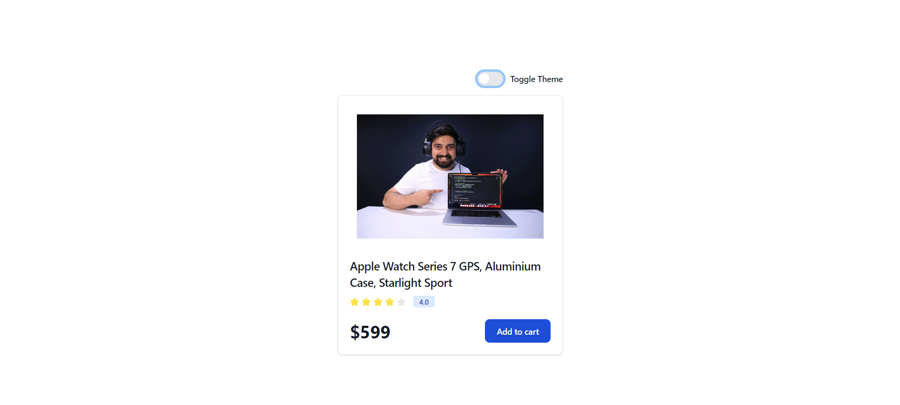
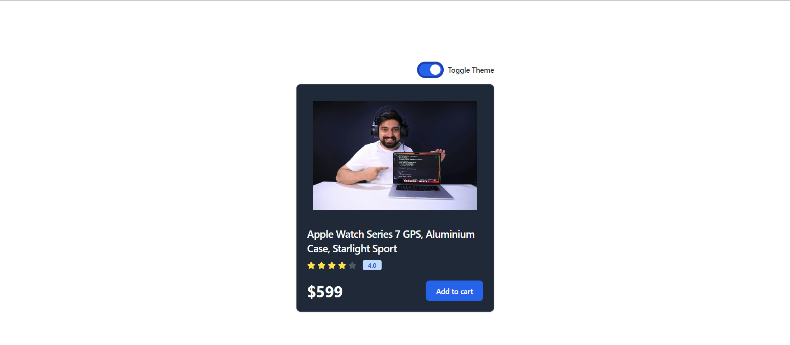

# Background Theme Switcher

The To-Do application includes a background theme switcher, allowing users to toggle between light and dark themes. This feature enhances user experience by providing a visually appealing interface that can be adjusted according to the user's preference.

## Features

- **Toggle Between Light and Dark Themes**: Users can switch the application’s background between light and dark modes with a single click.
- **Persisted Theme Preference**: The selected theme is saved and applied automatically on subsequent visits.

## Implementation

<a href="https://background-switchera-app.netlify.app/">Link to Background Switcher</a>

## Screenshot

